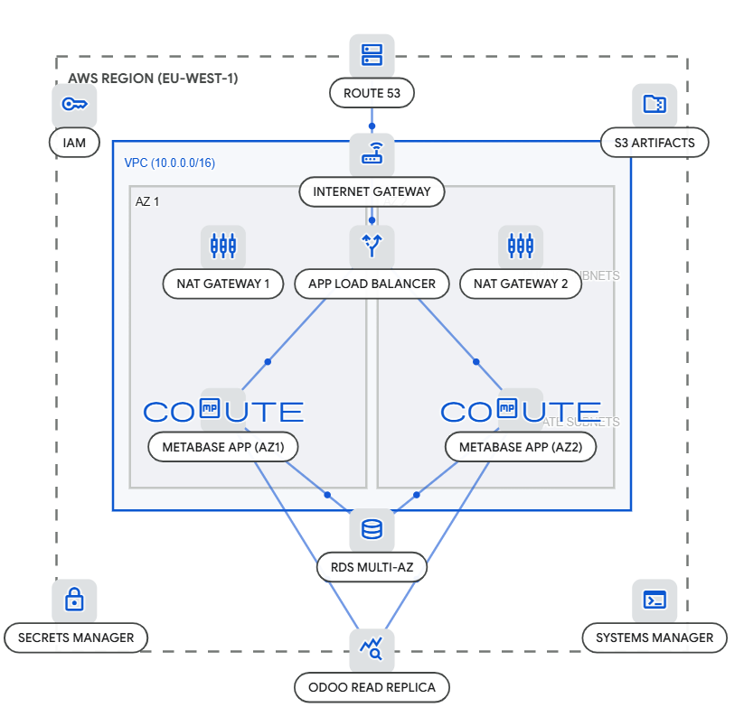

# Metabase High Availability AWS Deployment

This repository contains the Infrastructure as Code (IaC) and configuration management scripts for a highly available, secure, and self-healing deployment of Metabase on AWS. The infrastructure is primarily provisioned using Terraform, with instance configuration managed by Ansible. 

The deployment is designed to query a business database (Odoo read replica) residing in a separate VPC via VPC Peering.

---

## 🏗️ Architecture Overview



The architecture is built for high availability (HA) across two Availability Zones (AZs) and follows strict security best practices, including isolated private subnets, IAM role-based access, and least-privilege security groups.

### Networking & Routing
* **VPC:** Custom VPC spanning two Availability Zones.
* **Subnets:** Public subnets for load balancing and NAT gateways; Private subnets for compute (EC2) and database (RDS) resources.
* **Application Load Balancer (ALB):** Deployed in the public subnets to distribute incoming HTTPS traffic across the EC2 target group.
* **NAT Gateways:** Deployed in public subnets to allow outbound internet access for instances in private subnets (e.g., for package updates or Metabase integrations).
* **VPC Peering:** Establishes a secure connection to a separate VPC to query the Odoo database read replica.
* **DNS (Route 53):** * **Public:** Routes the main domain to the ALB.
  * **Private Hosted Zone:** Resolves `db.metabase.internal` to the backend RDS endpoint for seamless database connection management.
* **SSL/TLS:** AWS Certificate Manager (ACM) provisions certificates for the ALB to secure transit.

### Compute
* **Auto Scaling Group (ASG):** Manages the Metabase EC2 instances across two private subnets for high availability and self-healing. Integrated with ALB health checks.
* **Target Group:** Contains 2 EC2 instances running the Metabase application.

### Database & Storage
* **Metabase Application Database:** Amazon RDS deployed in a Multi-AZ configuration for automatic failover. Located in private subnets.
* **Backups:** Automated daily RDS snapshots stored securely in an Amazon S3 bucket.
* **Business Data Source:** Metabase connects exclusively to a **read replica** of an Odoo database located in the peered VPC, ensuring analytical queries do not impact production Odoo performance.

### Security & Access
* **AWS Systems Manager (SSM):** Used for secure shell access to private EC2 instances without requiring bastion hosts or open inbound SSH ports.
* **IAM Roles:** EC2 instances are assigned IAM roles granting them precise permissions to access RDS, AWS Secrets Manager (for database credentials), and SSM.
* **Security Groups:** Configured with the principle of least privilege. For example, the RDS security group only allows ingress from the EC2 security group.
* **Secrets Management:** AWS Secrets Manager securely stores and rotates database credentials.

---

## 🛠️ Tech Stack

* **Infrastructure as Code:** Terraform
* **Configuration Management:** Ansible
* **Application:** Metabase
* **Cloud Provider:** Amazon Web Services (AWS)

---

## 🚀 Deployment Process

### Prerequisites
* Terraform installed locally (`>= 1.0.0`)
* Ansible installed locally
* AWS CLI configured with appropriate credentials
* Existing Odoo VPC and Read Replica (for peering setup)
* Domain name registered or hosted in Route 53

### 1. Infrastructure Provisioning (Terraform)
Navigate to the Terraform directory and initialize the environment:

```bash
cd terraform
terraform init
terraform plan
terraform apply
```
*Terraform will output the ALB DNS name, private IPs (if needed), and other resource identifiers.*

### 2. Configuration Management (Ansible)
Once the infrastructure is up, use SSM as the connection plugin to configure the private instances:

```bash
cd ansible
ansible-playbook -i inventory.aws_ec2.yml setup_metabase.yml
```
*Ensure your Ansible configuration is set up to use the `aws_ssm` connection plugin to reach the instances securely.*

---

## 🔒 Security Best Practices Implemented

1. **No Public IP Addresses for Compute/Data:** All EC2 and RDS instances reside in private subnets.
2. **No Bastion Hosts:** Leveraging AWS SSM Session Manager for terminal access eliminates the need for exposed SSH ports.
3. **Role-Based Access:** Applications authenticate to AWS services via instance profiles/IAM roles, never via hardcoded access keys.
4. **Encrypted Transit:** End-to-end encryption using ACM certificates on the ALB.
5. **Read-Only Analytics:** Metabase only queries the Odoo read replica to prevent accidental writes or performance degradation on the primary business database.
